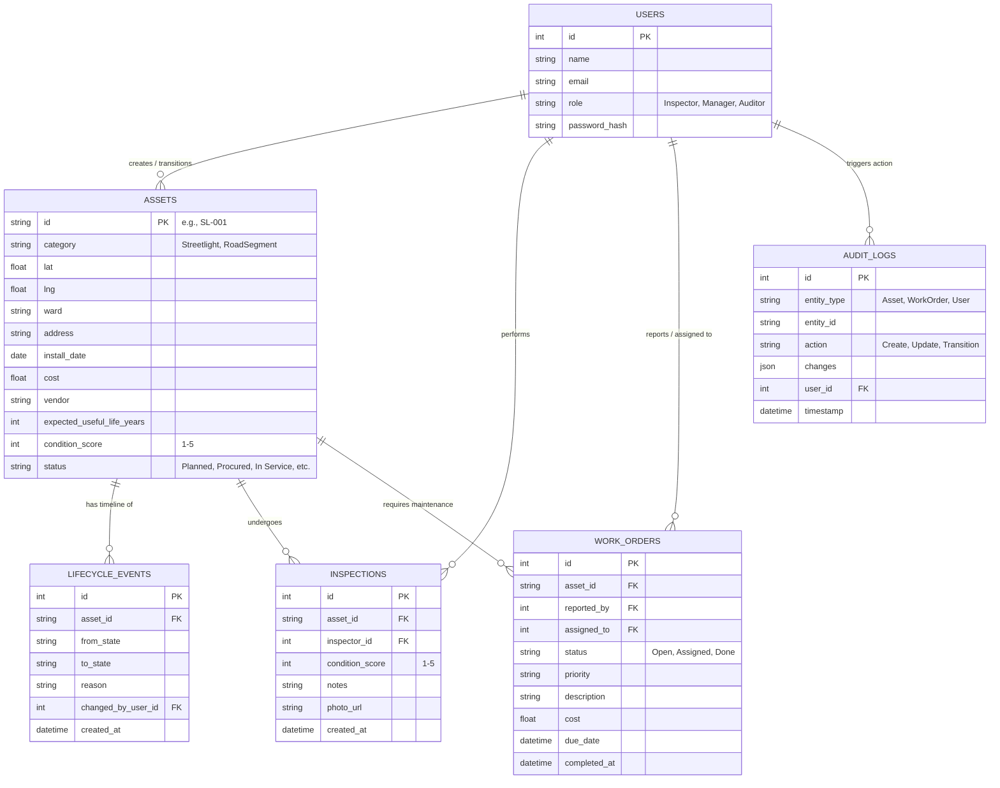

# Entity Relationship Diagram (ERD)

```mermaid
erDiagram
    USERS ||--o{ ASSETS : "creates / transitions"
    USERS ||--o{ INSPECTIONS : "performs"
    USERS ||--o{ WORK_ORDERS : "reports / assigned to"
    USERS ||--o{ AUDIT_LOGS : "triggers action"

    ASSETS ||--o{ LIFECYCLE_EVENTS : "has timeline of"
    ASSETS ||--o{ INSPECTIONS : "undergoes"
    ASSETS ||--o{ WORK_ORDERS : "requires maintenance"

    USERS {
        int id PK
        string name
        string email
        string role "Inspector, Manager, Auditor"
        string password_hash
    }

    ASSETS {
        string id PK "e.g., SL-001"
        string category "Streetlight, RoadSegment"
        float lat
        float lng
        string ward
        string address
        date install_date
        float cost
        string vendor
        int expected_useful_life_years
        int condition_score "1-5"
        string status "Planned, Procured, In Service, etc."
    }

    LIFECYCLE_EVENTS {
        int id PK
        string asset_id FK
        string from_state
        string to_state
        string reason
        int changed_by_user_id FK
        datetime created_at
    }

    INSPECTIONS {
        int id PK
        string asset_id FK
        int inspector_id FK
        int condition_score "1-5"
        string notes
        string photo_url
        datetime created_at
    }

    WORK_ORDERS {
        int id PK
        string asset_id FK
        int reported_by FK
        int assigned_to FK
        string status "Open, Assigned, Done"
        string priority
        string description
        float cost
        datetime due_date
        datetime completed_at
    }

    AUDIT_LOGS {
        int id PK
        string entity_type "Asset, WorkOrder, User"
        string entity_id
        string action "Create, Update, Transition"
        json changes
        int user_id FK
        datetime timestamp
    }
```
